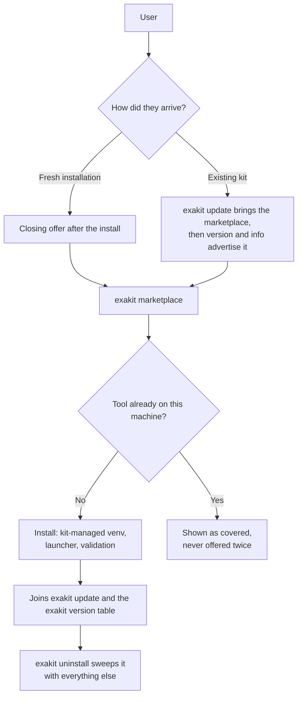
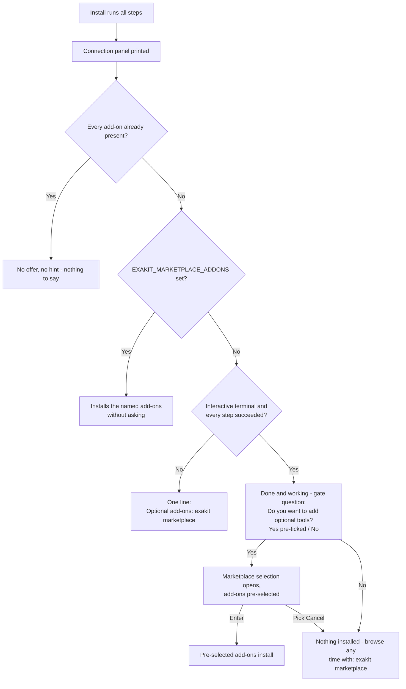
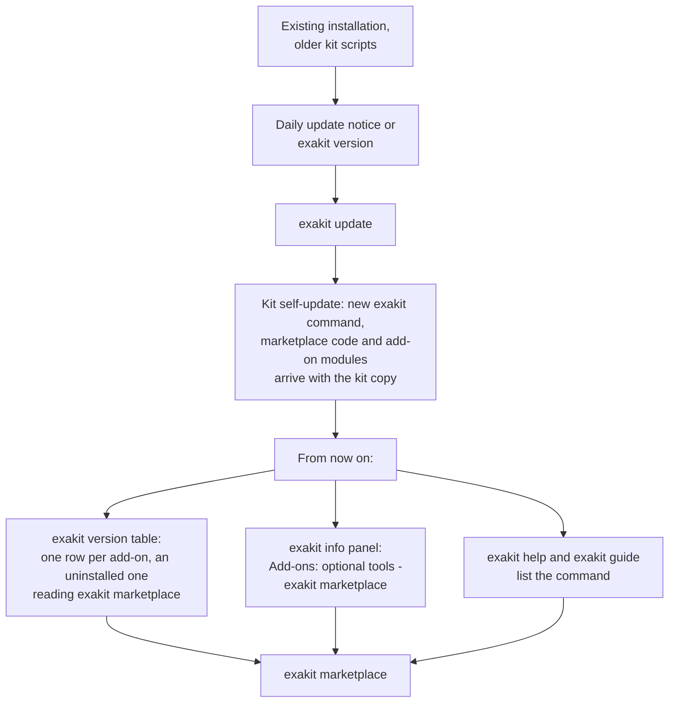
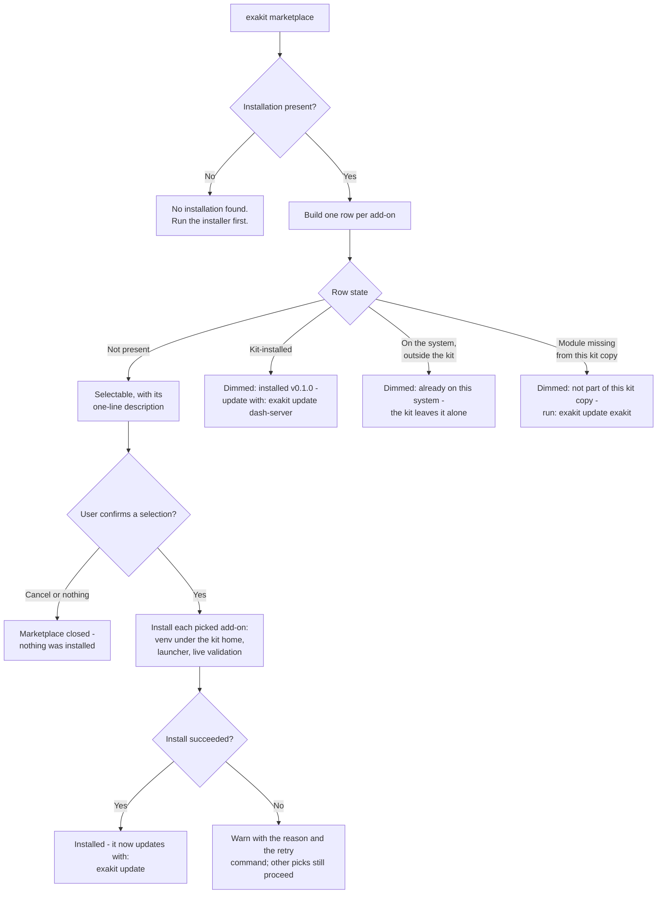
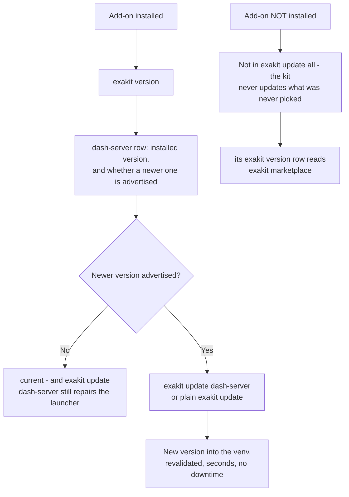
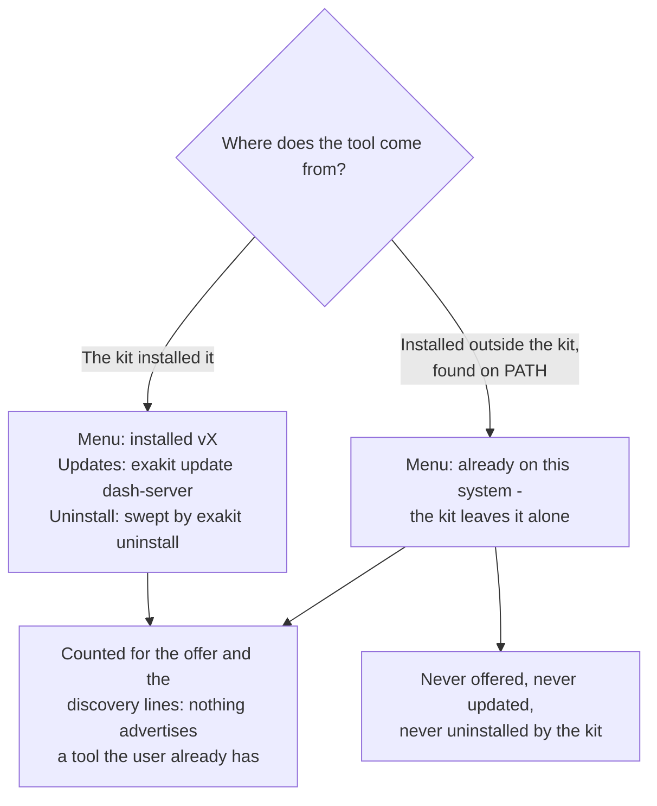
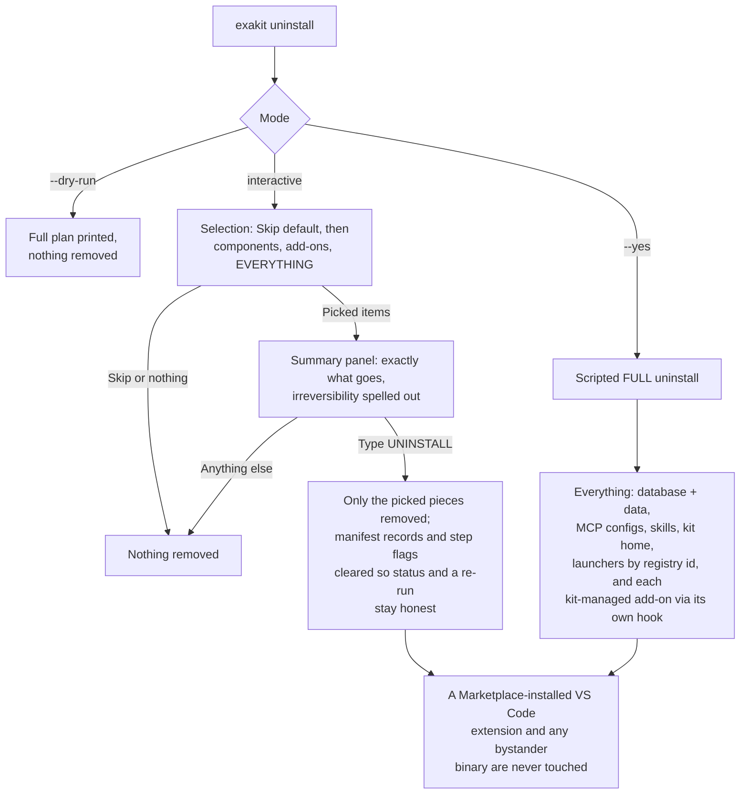

# Marketplace add-on flows

How a user meets the marketplace, in every scenario: a fresh installation, an
existing kit, browsing, updating, and removal. Each diagram node that names a
scenario links to its section. For the developer walkthrough (adding a new
add-on), see [MARKETPLACE.md](MARKETPLACE.md).

Contents:
[At a glance](#at-a-glance) ·
[1. Fresh installation](#scenario-1-fresh-installation) ·
[2. Existing kit, via the update path](#scenario-2-existing-kit-via-the-update-path) ·
[3. Browsing and installing](#scenario-3-browsing-and-installing) ·
[4. Keeping an add-on up to date](#scenario-4-keeping-an-add-on-up-to-date) ·
[5. The tool is already on the machine](#scenario-5-the-tool-is-already-on-the-machine) ·
[6. Removal](#scenario-6-removal) ·
[Where the marketplace appears](#where-the-marketplace-appears) ·
[Quick reference](#quick-reference)

---

## At a glance

One add-on, from first contact to removal:



Two rules explain everything below:

1. The install flow never installs an add-on. The marketplace is the only
   install path, and the user always says yes first.
2. A tool that is already on the machine — installed by the kit or found on
   the system — is never advertised. The kit updates only what it installed.

---

## Scenario 1: Fresh installation

The installation itself is unchanged: database, exapump, MCP server, pyexasol,
the exakit command. The marketplace appears once, at the very end, and only
when there is something to offer.



What the user sees on an interactive run — a selection, never typing:

```
[ok] Your Starter Kit installation is done and working.
 -   The marketplace has more useful tools for it.
 -   Do you want to add optional tools?
    > [x] Yes - show the marketplace
      [ ] No - maybe later

  Marketplace add-ons
  -------------------
Add-on         Status               Version        Action
dash-server    available            0.1.0          select below to install

    - Select add-ons to install
    > [x] Available add-ons
      [x]  - dash-server (AI dashboard host) - Agent-built live dashboards ...
      [ ] Cancel (install nothing)
```

Details that matter:

- A run with soft failures (a step that did not finish) gets the one-line
  hint, not the "done and working" message.
- A scripted or agent-driven install is never blocked by a question:
  `EXAKIT_MARKETPLACE_ADDONS=dash-server` (or `all` / `none`) answers it, and
  with nothing set the offer degrades to the hint line.
- Nothing in the offer can fail the install that just succeeded; it runs
  best-effort on every platform.

## Scenario 2: Existing kit, via the update path

A user who installed the kit before the marketplace existed reaches it
through the normal update mechanism. No reinstall.



Discovery is dynamic: `exakit version` gives a row only to an add-on this
machine could actually install, and an installed one reads as an ordinary
component instead. An updated kit whose user already has every tool never
mentions the marketplace at all.

The dim `Optional add-ons are available (dash-server) ...` footer under the
table is gone. It repeated, once per screen, the command the rows already
carry.

## Scenario 3: Browsing and installing

`exakit marketplace` is one screen in the kit's established look: first the
state of every add-on as an aligned table (the same shape `exakit
version` prints), then — when anything is installable — the same
tree-checkbox the data-load menu uses. The available add-ons come
pre-selected (exactly like the data-load menu pre-selects pending datasets),
so Enter installs them; Space toggles, and Cancel is the explicit opt-out.

```
  Marketplace add-ons
  -------------------
Add-on         Status               Version        Action
dash-server    available            0.1.0          select below to install

    - Select add-ons to install
    > [x] Available add-ons
      [x]  - dash-server (AI dashboard host) - Agent-built live dashboards ...
      [ ] Cancel (install nothing)
```



For dash-server specifically, "install" means: a Python venv at
`~/.exasol-starter-kit/dash-server-venv` (created with pip seeded, and
self-repaired if a pre-existing venv lacks pip), a launcher at
`~/.local/bin/dash-server` that bootstraps the kit's database connection at
run time (the password itself is never written into any file), and a live
check that the MCP control plane answers on `http://127.0.0.1:5100/mcp`
before the add-on is reported ready.

Non-interactive use, same contract as the closing offer:

```bash
EXAKIT_MARKETPLACE_ADDONS=dash-server exakit marketplace   # ids csv, all, or none
```

## Scenario 4: Keeping an add-on up to date

Once installed, an add-on is a normal component. Nothing new to learn.



- `exakit update` (all) covers installed add-ons automatically and never
  touches uninstalled ones.
- `exakit version` lists the add-on with the live version from the venv.
- The advertised version comes from `versions.json` like every component;
  maintainers bump it with a one-file pull request and CI verifies the
  release tag exists before it lands.

## Scenario 5: The tool is already on the machine

The dynamic rule, in both directions:



Detection is honest in both directions: a stale manifest record without a
real install does not count as installed (the live probe is the authority),
and the kit's own launcher on PATH is not mistaken for a system install.

## Scenario 6: Removal

`exakit uninstall` is a selection too: Skip is the pre-selected safe default,
then the components actually on the machine, then the kit-managed add-ons —
each removable on its own — then EVERYTHING. What was picked is shown back in
a summary panel before the typed UNINSTALL gate.



## Where the marketplace appears

| Surface | When | What it says |
|---|---|---|
| End of a successful interactive install | Something still on offer | The one-time offer: done and working, add tools now? |
| End of any other install | Something still on offer | One hint line naming the command |
| `exakit version` table | Something still on offer | A row per add-on, an uninstalled one reading `exakit marketplace` in its Status cell |
| `exakit info` panel | Something still on offer | `Add-ons: optional tools (dashboards & more): exakit marketplace` |
| `exakit guide`, `exakit help`, `exakit catalog` | Always | The command with a one-line description |
| Anywhere above | Everything already present | Nothing - every mention disappears |

## Quick reference

| Situation | Command or event | Outcome |
|---|---|---|
| Fresh install, interactive, all green | closing offer | gate question (Yes pre-ticked / No), then the selection menu with add-ons pre-selected; Enter installs, Cancel or No skips |
| Fresh install, scripted | `EXAKIT_MARKETPLACE_ADDONS=...` | Installs the named add-ons, no questions |
| Kit from before the marketplace | `exakit update` | Kit self-update delivers the command; discovery lines take over |
| Browse | `exakit marketplace` | One row per add-on with live state; Space and Enter |
| Install failed | menu output | Reason plus retry command; nothing else breaks |
| Update one add-on | `exakit update dash-server` | Advertised version installed and revalidated |
| Update everything | `exakit update` | Installed add-ons included, others never touched |
| Tool already on the system | any surface | Respected and skipped; the kit does not manage it |
| Remove one add-on | `exakit uninstall` | Pick it from the selection; its own hook removes it, summary + typed gate first |
| Remove the kit | `exakit uninstall` (EVERYTHING row, or `--yes`) | Full teardown, kit-managed add-ons included via their hooks; Marketplace-installed copies untouched |

Every behavior in this document is enforced by the automated suites
(`tests/marketplace.sh`, `tests/dry-run-matrix.sh`, `tests/uninstall.sh`) and
the sandboxed end-to-end run (`tests/marketplace-e2e.sh`).
