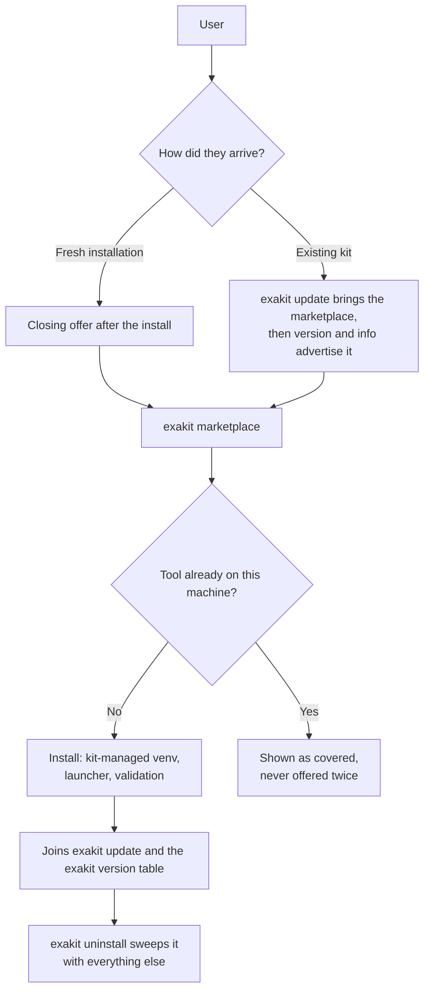
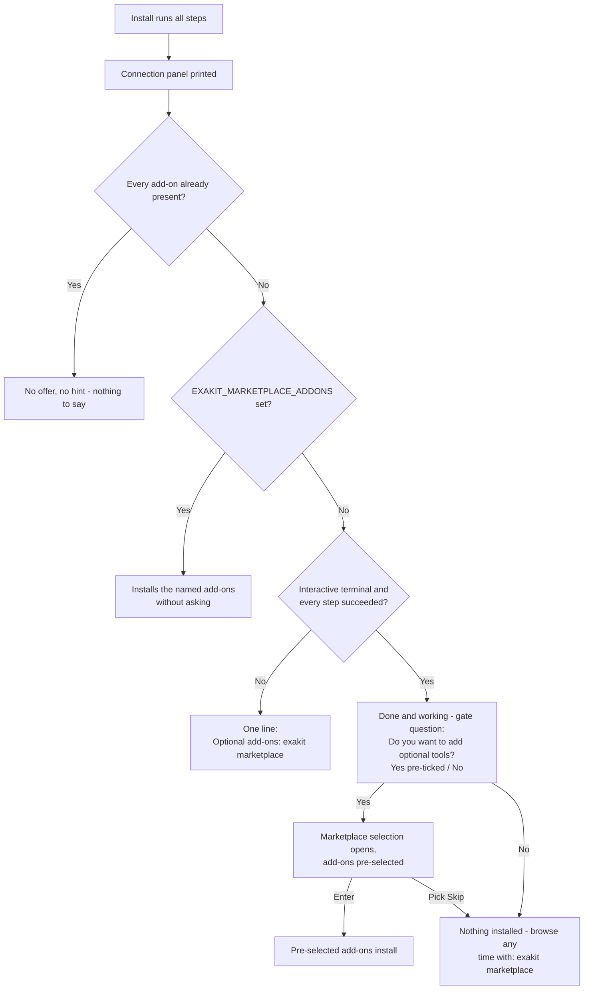
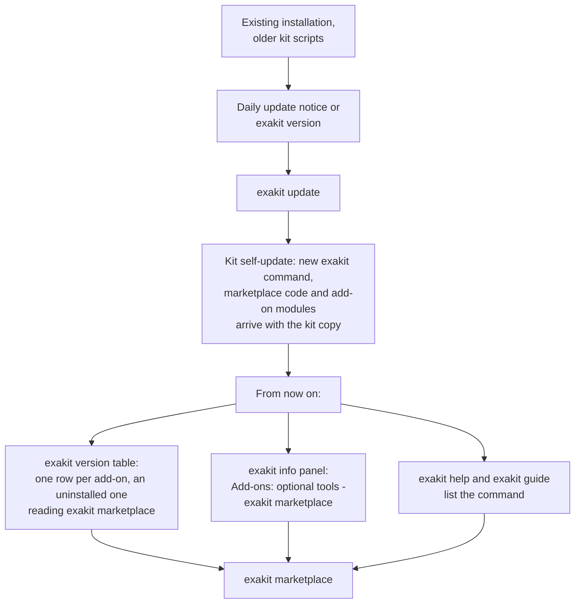
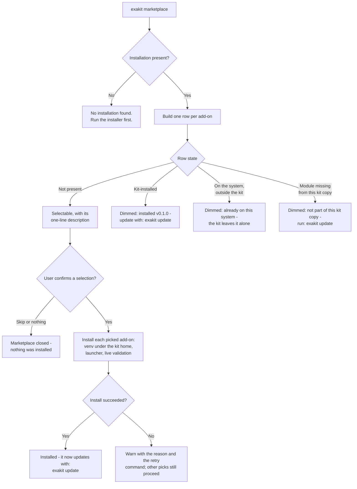
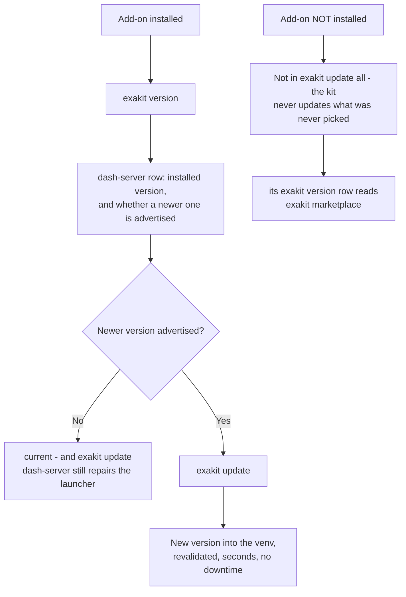
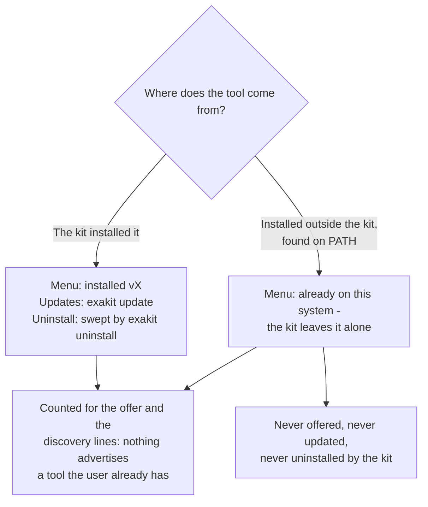
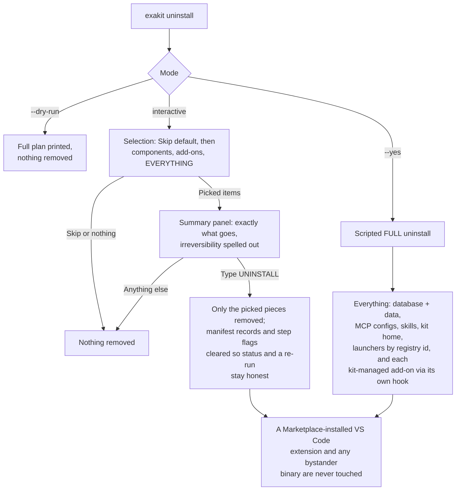

# The marketplace: optional add-ons, and how to add one

The marketplace is the kit's home for **optional tools** — things worth having
next to the database but not worth lengthening the install for. dash-server
(the AI dashboard host) is the first one.

This document is three things: the contract for how the marketplace behaves,
how a user meets it in every scenario — fresh installation, existing kit,
browsing, updating, removal — each with a flowchart, and the **complete
walkthrough for adding a new add-on**, which is deliberately three additive
changes with no case-statement surgery anywhere.

Contents:
[How it behaves](#how-it-behaves-the-contract) ·
[At a glance](#at-a-glance) ·
[1. Fresh installation](#scenario-1-fresh-installation) ·
[2. Existing kit, via the update path](#scenario-2-existing-kit-via-the-update-path) ·
[3. Browsing and installing](#scenario-3-browsing-and-installing) ·
[4. Keeping an add-on up to date](#scenario-4-keeping-an-add-on-up-to-date) ·
[5. The tool is already on the machine](#scenario-5-the-tool-is-already-on-the-machine) ·
[6. Removal](#scenario-6-removal) ·
[Where the marketplace appears](#where-the-marketplace-appears) ·
[Quick reference](#quick-reference) ·
[Where the pieces live](#where-the-pieces-live) ·
[Adding a new add-on](#adding-a-new-add-on-the-walkthrough) ·
[Verifying](#verifying)

---

## How it behaves (the contract)

- **Never in the install flow.** The setup scripts install nothing from the
  marketplace. After a successful interactive install, the closing screen
  says *"Your Starter Kit installation is done and working"* and asks one
  gate question as a cursor selection — *Do you want to add optional tools?*
  with Yes pre-ticked and No as the opt-out. Yes opens the marketplace
  selection, where the available add-ons come pre-selected (exactly like the
  data-load menu pre-selects pending datasets), so Enter installs them and
  the Skip row still backs out; No prints the one command to come back with. No
  typing anywhere.
- **`exakit marketplace`** is the command: every add-on with a one-line
  description, Space selects, Enter installs. Non-interactive runs (agents,
  CI) answer with `EXAKIT_MARKETPLACE_ADDONS=<ids csv | all | none>` instead —
  this also pre-answers the closing offer.
- **Dynamic by applicability.** An add-on that extends something the user does
  not have is not offered at all — no row, no table line, no mention anywhere.
  The VS Code extension is only listed on a machine that has VS Code; naming
  it anyway (`EXAKIT_MARKETPLACE_ADDONS=exasol-vscode`) explains that the host
  app is missing instead of failing deep in the installer. A copy the kit
  already installed stays visible even if the host app disappears later, so it
  can still be updated or removed.
- **Dynamic by presence.** An add-on already on the machine is never
  advertised — whether the kit installed it (shown as *installed (vX)*) or it
  was already on the system outside the kit (shown as *already on this system —
  the kit leaves it alone*; the kit never updates or uninstalls what it did
  not install). When everything is present, the offer and the discovery lines
  disappear entirely.
- **Installed add-ons are full components.** They join `exakit update`,
  report in `exakit version`, pin with
  `EXAKIT_<ID>_VERSION`, and are swept by `exakit uninstall`. Add-ons you never
  picked are never touched by `update all`.

---

## At a glance

One add-on, from first contact to removal:



---

## Scenario 1: Fresh installation

The installation itself is unchanged: database, exapump, MCP server, pyexasol,
the exakit command. The marketplace appears once, at the very end, and only
when there is something to offer.



What the user sees on an interactive run — a selection, never typing:

```
[ok] Your Starter Kit installation is done and working.
 -   The marketplace has more useful tools for it.
 -   Do you want to add optional tools?
    > [x] Yes - show the marketplace
      [ ] No - maybe later
```

Answering yes opens exactly the screen
[Scenario 3](#scenario-3-browsing-and-installing) shows — the same table, the
same pre-ticked rows, the same `Skip`.

Details that matter:

- A run with soft failures (a step that did not finish) gets the one-line
  hint, not the "done and working" message.
- A scripted or agent-driven install is never blocked by a question:
  `EXAKIT_MARKETPLACE_ADDONS=dash-server` (or `all` / `none`) answers it, and
  with nothing set the offer degrades to the hint line.
- Nothing in the offer can fail the install that just succeeded; it runs
  best-effort on every platform.

## Scenario 2: Existing kit, via the update path

A user who installed the kit before the marketplace existed reaches it
through the normal update mechanism. No reinstall.



Discovery is dynamic: `exakit version` gives a row only to an add-on this
machine could actually install, and an installed one reads as an ordinary
component instead. An updated kit whose user already has every tool never
mentions the marketplace at all.

The dim `Optional add-ons are available (dash-server) ...` footer under the
table is gone. It repeated, once per screen, the command the rows already
carry.

## Scenario 3: Browsing and installing

`exakit marketplace` is one screen in the kit's established look: a single
tree-checkbox table, the same component the data-load menu uses, carrying the
add-on, its version and its one-line description. The available add-ons come
pre-selected (exactly like the data-load menu pre-selects pending datasets),
so Enter installs them; Space toggles, and the `Skip` row is the explicit
opt-out. With no terminal nothing is installed at all — the run says so and
names `exakit marketplace --list`, `exakit marketplace <id>` and
`EXAKIT_MARKETPLACE_ADDONS`.

```
  ╭─ Marketplace add-ons ────────────────────────────────────────────────────╮
  │     Add-on               Version  Description                            │
  │ [✓] Select All                                                           │
  │ [✓] ├─ dash-server       0.1.0    Agent-operated Dash hosting for live   │
  │     │                             analytical apps                        │
  │ [✓] ├─ exasol-scheduler  0.2      Lightweight table-driven SQL job       │
  │     │                             scheduling for Exasol                  │
  │ [✓] ├─ exasol-vscode     1.7.0    A Visual Studio Code extension for     │
  │     │                             working with Exasol databases.         │
  │ [✓] └─ json-tables       0.3      Exasol JSON Tables: ingest, query, and │
  │                                   reshape JSON-shaped data in Exasol.    │
  │ [ ] Skip                                                                 │
  ╰──────────────────────────────────────────────────────────────────────────╯
```

An add-on this machine cannot install — no VS Code-compatible editor, no
prebuilt binary for the architecture, already installed outside the kit — gets
a dimmed, unpickable row carrying the reason instead, or no row at all when it
is neither applicable nor present. The descriptions are each repository's
GitHub About, fetched and cached; offline the kit falls back to the tagline in
`setup/help/<id>.json`, so the wording of a row can differ from the capture
above. The same rows fill in with progress as each pick installs — the
selection and the install are one table, not two screens.



For dash-server specifically, "install" means: a Python venv at
`~/.exasol-starter-kit/dash-server-venv` (created with pip seeded, and
self-repaired if a pre-existing venv lacks pip), a launcher at
`~/.local/bin/dash-server` that bootstraps the kit's database connection at
run time (the password itself is never written into any file), and a live
check that the MCP control plane answers on `http://127.0.0.1:5100/mcp`
before the add-on is reported ready.

**That control plane is loopback-only and unauthenticated.** Anything that can
reach `127.0.0.1` on the machine can call its tools, which build, deploy and
pip-install dependencies for Dash apps as the installing user. Fine on a
personal laptop; on a shared or multi-user machine, stop dash-server when it is
not in use (`exakit stop`), and never expose the port on a LAN or through a
tunnel. dash-server is also the one add-on installed **without a kit-pinned
checksum** — the version is tag-pinned, but a GitHub source tarball publishes no
digest to verify the download against, and its Python dependencies come from
PyPI unpinned. Every other add-on refuses an artifact whose digest it cannot
check.

Non-interactive use, same contract as the closing offer:

```bash
EXAKIT_MARKETPLACE_ADDONS=dash-server exakit marketplace   # ids csv, all, or none
```

## Scenario 4: Keeping an add-on up to date

Once installed, an add-on is a normal component. Nothing new to learn.



- `exakit update` (all) covers installed add-ons automatically and never
  touches uninstalled ones.
- `exakit version` lists the add-on with the live version from the venv.
- The advertised version comes from `versions.json` like every component;
  maintainers bump it with a one-file pull request and CI verifies the
  release tag exists before it lands.

## Scenario 5: The tool is already on the machine

The dynamic rule, in both directions:



Detection is honest in both directions: a stale manifest record without a
real install does not count as installed (the live probe is the authority),
and the kit's own launcher on PATH is not mistaken for a system install.

## Scenario 6: Removal

`exakit uninstall` is a selection too: Skip is the pre-selected safe default,
then the components actually on the machine, then the kit-managed add-ons —
each removable on its own — then EVERYTHING. What was picked is shown back in
a summary panel before the typed UNINSTALL gate.



## Where the marketplace appears

| Surface | When | What it says |
|---|---|---|
| End of a successful interactive install | Something still on offer | The one-time offer: done and working, add tools now? |
| End of any other install | Something still on offer | One hint line naming the command |
| `exakit version` table | Something still on offer | A row per add-on, an uninstalled one reading `exakit marketplace` in its Status cell |
| `exakit info` panel | Something still on offer | `Add-ons: optional tools (dashboards & more): exakit marketplace` |
| `exakit guide`, `exakit help`, `exakit catalog` | Always | The command with a one-line description |
| Anywhere above | Everything already present | Nothing - every mention disappears |

## Quick reference

| Situation | Command or event | Outcome |
|---|---|---|
| Fresh install, interactive, all green | closing offer | gate question (Yes pre-ticked / No), then the selection menu with add-ons pre-selected; Enter installs, Skip or No skips |
| Fresh install, scripted | `EXAKIT_MARKETPLACE_ADDONS=...` | Installs the named add-ons, no questions |
| Kit from before the marketplace | `exakit update` | Kit self-update delivers the command; discovery lines take over |
| Browse | `exakit marketplace` | One row per add-on with live state; Space and Enter |
| Install failed | menu output | Reason plus retry command; nothing else breaks |
| Update one add-on | `exakit update` | Advertised version installed and revalidated |
| Update everything | `exakit update` | Installed add-ons included, others never touched |
| Tool already on the system | any surface | Respected and skipped; the kit does not manage it |
| Remove one add-on | `exakit uninstall` | Pick it from the selection; its own hook removes it, summary + typed gate first |
| Remove the kit | `exakit uninstall` (EVERYTHING row, or `--yes`) | Full teardown, kit-managed add-ons included via their hooks; Marketplace-installed copies untouched |

Every behavior in the scenarios above is enforced by the automated suites
(`tests/marketplace.sh`, `tests/dry-run-matrix.sh`, `tests/uninstall.sh`) and
the sandboxed end-to-end run (`tests/marketplace-e2e.sh`).

---

The rest of this document is for whoever adds an add-on.

## Where the pieces live

| Piece | bash | PowerShell |
|---|---|---|
| Registry + menu + offer + generic arms | `setup/lib/common.sh` (marketplace block) | `setup/lib/exakit-common.ps1` (marketplace block), registry arms in `setup/exakit.ps1` |
| The add-on itself | `setup/lib/<id>.sh` | `setup/lib/<id>.ps1` |
| CLI entry point | `setup/exakit` (`cmd_marketplace`) | `setup/exakit.ps1` (`Invoke-CmdMarketplace`) |
| Closing offer call | `setup/setup-macos.sh`, `setup/setup-wsl.sh` | `setup/setup-windows-docker.ps1` |

Every registry function — version block, env override, fallback, upstream
lookup, installed probe, update targets and dispatch — resolves a registered
add-on through **one generic arm driven by conventions**, so a new add-on
needs no edits there. The conventions, for an id like `my-tool`:

| Convention | Value for `my-tool` |
|---|---|
| Module functions (bash; dashes → underscores) | `my_tool_install`, `my_tool_validate`, `my_tool_update`, `my_tool_installed_version`, `my_tool_uninstall`; a tool that *runs* adds `my_tool_status`, `my_tool_start`, `my_tool_stop`, `my_tool_autostart_command`, `my_tool_log_path`; a tool that extends a host app adds `my_tool_applicable` (+ `my_tool_applicable_reason`); a tool whose installable version is not a plain upstream release adds `my_tool_latest`; sharpen manual-install detection with `my_tool_system_present` |
| Version env override / fallback (bash) | `EXAKIT_MY_TOOL_VERSION`, `EXAKIT_MY_TOOL_VERSION_FALLBACK` |
| versions.json block | `components.my-tool` (`repo` = GitHub release, `package` = PyPI — the generic upstream lookup reads whichever is present; neither, plus a `my_tool_latest` hook, when the kit repackages the tool itself — see json-tables) |
| Manifest keys | `components.my_tool.*`, `desired.my_tool` |
| Kit-managed state | venv/state under `$EXAKIT_HOME`, launcher at `$EXAKIT_BIN_DIR/my-tool` (swept by uninstall automatically, by registry id) |
| PowerShell functions | named explicitly in the registry entry (no derivation) |

---

## Adding a new add-on: the walkthrough

Three changes, one PR. `setup/lib/dash-server.sh` / `.ps1` are the reference
implementation — copy them when in doubt.

Pick your reference by what the tool is:

- **A Python package that installs straight from its tagged source** → copy
  dash-server (venv, launcher, live validation). Copy its *shape*, not its
  supply chain: it installs a GitHub source tarball, which publishes no digest,
  so it is the one add-on with nothing to verify. If your tool publishes a wheel
  or an sdist, pin its `sha256` in versions.json and fail closed on a missing
  digest, the way the other three do.
- **An extension to a host application** → copy exasol-vscode (the
  `_applicable` gate, the host-app CLI discovery, the refusal to touch a copy
  the user installed themselves).
- **A tool users cannot install as shipped** (needs a toolchain, ships no
  binaries, hardcodes a build step) → copy **json-tables**: a packaging
  workflow in this repo (`.github/workflows/pkg-json-tables.yml`) assembles the
  artifacts once for every platform — downloading and digest-verifying the ones
  upstream prebuilds, building only the rest — and publishes them as **one immutable
  release per build** (`<id>-<version>`, never rewritten); the module downloads
  the prebuilt pair from the release versions.json names and verifies each
  against the digest pinned there, "latest" is the advertised version
  (`<id>_latest` hook) so nothing is ever offered before it is built, and the
  workflow's `advertise` job writes the whole pin — version, release tag,
  wheel, digests — by pull request only after a successful publish. A rolling
  tag is the one shape to avoid: overwriting its assets breaks every pinned
  install until the pins catch up.

### 1. Ship the module pair

**`setup/lib/my-tool.sh`** — the skeleton every add-on follows:

```bash
#!/usr/bin/env bash
# my-tool.sh — my-tool (<one-line purpose>): managed install + validation.
# A MARKETPLACE ADD-ON: never installed by the setup scripts.

# The add-on's version constants live here, next to the code that uses them —
# the generic registry arms find them by the derived-name convention, and the
# versions-bump workflow keeps the fallback in lockstep with versions.json.
EXAKIT_MY_TOOL_VERSION="${EXAKIT_MY_TOOL_VERSION:-}"
EXAKIT_MY_TOOL_VERSION_FALLBACK="${EXAKIT_MY_TOOL_VERSION_FALLBACK:-1.0.0}"
EXAKIT_MY_TOOL_REPO="${EXAKIT_MY_TOOL_REPO:-exasol-labs/my-tool}"

# The live probe: answer with the installed version, FAIL for a provably
# absent install. This is what keeps a stale manifest record from ever
# claiming "installed".
my_tool_installed_version() {
    # e.g. "$venv_python" -c 'from importlib.metadata import version; ...'
    return 1
}

# Soft-fail helper: marketplace installs must never end the caller's run.
_my_tool_not_installed() {
    warn "my-tool was not installed: $1"
    warn "Everything else in the kit is unaffected. Retry with: exakit update"
    command -v exakit_note_failure >/dev/null 2>&1 && exakit_note_failure "$1"
    manifest_set components.my_tool.validated false
    return 1
}

my_tool_install() {
    # The marketplace path runs from the exakit CLI, where the installer's
    # version resolution has not run — resolve the advertised version here.
    if [ -z "${EXAKIT_MY_TOOL_VERSION:-}" ]; then
        EXAKIT_MY_TOOL_VERSION="$(exakit_component_available my-tool 2>/dev/null || true)"
        [ -n "$EXAKIT_MY_TOOL_VERSION" ] || EXAKIT_MY_TOOL_VERSION="$EXAKIT_MY_TOOL_VERSION_FALLBACK"
        export EXAKIT_MY_TOOL_VERSION
    fi
    # ... install (venv under $EXAKIT_HOME, launcher in $EXAKIT_BIN_DIR) ...
    # On any failure: _my_tool_not_installed "<reason>"; return 1
    manifest_set components.my_tool.version "$EXAKIT_MY_TOOL_VERSION"
}

# Prove it actually works; record validated=true/false. Soft — return 0 even
# when validation fails (the failure has already explained itself).
my_tool_validate() {
    manifest_set components.my_tool.validated true
    return 0
}

# Install the advertised version. Doubles as the repair command; asked for
# explicitly, so a failure here IS a failure (die).
my_tool_update() {
    _available="$(exakit_component_available my-tool 2>/dev/null || true)"
    [ -n "$_available" ] || die "Could not resolve the advertised my-tool version."
    _current="$(my_tool_installed_version 2>/dev/null || true)"
    if [ -n "$_current" ] && [ "$_current" = "$_available" ]; then
        ok "my-tool is already current ($_current)"
        return 0
    fi
    EXAKIT_MY_TOOL_VERSION="$_available"
    export EXAKIT_MY_TOOL_VERSION
    my_tool_install || die "my-tool could not be installed — see the warning above."
    my_tool_validate || true
    manifest_set desired.my_tool "$EXAKIT_MY_TOOL_VERSION"
    ok "my-tool updated; database data was not changed"
}

# Remove what the install put on this machine (with "1": narrate the plan
# only). This one hook folds the add-on into the selectable
# `exakit uninstall` menu AND the full teardown — no other wiring exists.
# Best-effort, idempotent, and it must refuse anything the kit does not
# manage (see exasol_vscode_uninstall for the pattern).
my_tool_uninstall() {
    _dry="${1:-0}"
    # rm the kit-managed artifacts; then:
    # manifest_del components.my_tool; manifest_del desired.my_tool
    return 0
}

# OPTIONAL — only for an add-on that extends a host application. Return
# non-zero when the host is absent and the add-on is hidden everywhere instead
# of being offered and then failing (see exasol_vscode_applicable).
# my_tool_applicable()        { command -v the-host-app >/dev/null 2>&1; }
# my_tool_applicable_reason() { printf '%s\n' "the host app was not found"; }

# OPTIONAL — only for an add-on that RUNS as a service. Defining these four
# folds it into `exakit status`, `exakit start`, `exakit stop` and the boot
# entries (`exakit autostart`) with no wiring anywhere else.
# my_tool_status()            { ... }   # running | stopped | not installed
# my_tool_start()             { ... }   # background it, wait until it answers
# my_tool_stop()              { ... }   # bounded, idempotent
# my_tool_autostart_command() { ... }   # what the boot entry runs
# my_tool_log_path()          { ... }   # what `exakit logs my-tool` shows

# OPTIONAL: sharpen "already on this system" detection beyond the default
# check (the id AND the launcher's basename from EXAKIT_MY_TOOL_BIN on PATH),
# e.g. an import probe for PATH-less pip installs (see json_tables_system_present).
# my_tool_system_present() { ... }

# OPTIONAL — only when "installable" is stricter than "released upstream".
# json-tables is the model: the kit prebuilds its artifacts in a packaging
# workflow, so what CAN be installed is what that workflow has published and
# versions.json advertises, not what upstream tagged. The generic upstream
# lookup calls this hook first; json_tables_latest answers from versions.json
# alone, with no network call.
# my_tool_latest() { ... }   # print the newest INSTALLABLE version
```

**`setup/lib/my-tool.ps1`** — the twin. Same shape with the house verbs
(`Install-MyTool`, `Test-MyTool`, `Update-MyTool`, `Get-MyToolInstalledVersion`,
`Write-MyToolNotInstalled`) and its own
`$script:MyToolVersionFallback = if ($env:EXAKIT_MY_TOOL_VERSION_FALLBACK) { $env:EXAKIT_MY_TOOL_VERSION_FALLBACK } else { "1.0.0" }`.

Hard rules for both files (CI enforces them):

- bash stays **3.2**-compatible (macOS default); PowerShell stays **5.1**-
  compatible (no ternary, no `??`).
- The `.ps1` is **pure ASCII** — no em dashes, no box-drawing glyphs
  (`tests/ps-encoding-guard.sh` scans every `.ps1` automatically).
- Install failures are **soft** (warn + `validated=false` + return non-zero),
  never `die` — the marketplace and the closing offer run best-effort.
- Secrets never land in generated files: bake credential-file *paths* into a
  launcher and read them at run time (see `dash_server_write_launcher`).

### 2. Add the versions.json block

```json
"my-tool": {
  "version": "1.0.0",
  "repo": "exasol-labs/my-tool",
  "severity": "normal"
}
```

`repo` for a GitHub-release-installed tool, `package` for a PyPI one — that
field is what the generic upstream lookup (`EXAKIT_VERSION_POLICY=latest`) and
the auto-bump workflow read. Keep the file canonical: `python3 -m json.tool
--indent 2` output, LF-only (CI diffs it).

### 3. Add one registry line each side

`setup/lib/common.sh`, in `exakit_marketplace_addons`:

```bash
printf '%s\n' "my-tool|my-tool (short label)"
```

Two fields, and no description: the one-liner the menu shows is the **About
field of your add-on's own repository**, fetched and cached at runtime (step 4).
Typing a description here is the drift this replaced — it used to be spelled out
in both registries and in the help document, and the three disagreed.

`setup/lib/exakit-common.ps1`, in `Get-ExakitMarketplaceAddons`:

```powershell
[pscustomobject]@{
    Id          = "my-tool"
    Label       = "my-tool (short label)"
    InstallFn   = "Install-MyTool"
    ValidateFn  = "Test-MyTool"
    UpdateFn    = "Update-MyTool"
    VersionFn   = "Get-MyToolInstalledVersion"
    EnvVar      = "EXAKIT_MY_TOOL_VERSION"
    FallbackVar = "MyToolVersionFallback"
}
```

### 4. Ship a help document — and with it, the description

`setup/help/my-tool.json`, alongside the other components' documents. Two of its
fields carry the marketplace:

```json
{
  "schema_version": 1,
  "id": "my-tool",
  "kind": "addon",
  "title": "my-tool",
  "tagline": "What it does, in one clause.",
  "repo": "exasol-labs/my-tool"
}
```

`repo` is where the About is read from — `https://api.github.com/repos/<repo>`,
resolved offline from this document, so a machine with no network still knows
which repository owns the wording. `tagline` is the help screen's own header
line, and it doubles as the answer when the About cannot be reached.

The description therefore needs no maintenance in this repository: write the
one-liner in your add-on's GitHub About and the marketplace picks it up within a
day (`EXAKIT_ABOUT_TTL`, default 86400s). What the kit does to that text before
printing it is not negotiable, though — it is prose from a repository the kit
does not control, so escape sequences and control bytes are stripped, it is
collapsed to one line and capped, on the way into the cache. It is then shown in
full: the Description column is 44 characters wide and folds onto as many lines
as the text needs, so nothing is cut off. A long About costs table rows rather
than meaning -- but the checkbox list below the table shows ids only, because the
shared checkbox layer keeps every menu row to exactly one terminal line.

Skipping this document is allowed — the row then reads
`Details: exakit help my-tool` — but the screen is worse for it.

### 5. Optional: ship an AI skill with it

If the add-on is worth teaching an agent to drive, add
`skills/my-tool/SKILL.md` with the usual `name` + `description` frontmatter and
one extra key naming its owner:

```yaml
---
name: my-tool
addon: my-tool
description: ... Triggers — "...".
---
```

That key is the whole wiring. The marketplace places the skill as part of
installing the add-on and removes it again when the add-on is uninstalled; the
AI-bridge step, which installs the core skills, leaves it alone until then. A
skill is a set of triggers for an agent to match on, and matching them for a
tool that is not on the machine is worse than not shipping the skill — so an
add-on's skill travels with the add-on, not with the kit.

Nothing in the shell or PowerShell learns the skill's name: the owner is read
out of the frontmatter. Bump `components.skills.version` in `versions.json`, add
a row to `skills/README.md` under the marketplace heading, and that is all.

### The CI guards (same PR, mechanical)

| File | Change |
|---|---|
| `.github/workflows/versions.yml` | Add `"my-tool"` to the `expected = {...}` components set; add an upstream-exists stanza (assert the release tag / PyPI version is real) |
| `.github/workflows/versions-bump.yml` | Add a `COUPLED` entry pointing at the module files' fallback constants; for a GitHub-release tool, add a bump stanza (copy the dash-server one) |

### What you do NOT touch

The registry line is the switch. The Description column and the checkbox
label's one-liner (both come from the About, cached, with the tagline behind
them), menu row, closing-offer row, presence detection, `exakit update
my-tool`, `update all` gating (installed only), `exakit version` row,
`EXAKIT_MARKETPLACE_ADDONS` parsing, uninstall sweep of the launcher and the
kit-home state, placing and removing the add-on's own skill — all generic. `tests/marketplace.sh` asserts `common.sh`
carries **zero** per-add-on case arms, so a regression back to hand-wired
arms fails CI.

---

## Verifying

Every behaviour this document describes is enforced by the automated suites —
the contract above, the scenarios, and the twin parity between each module's
`.sh` and `.ps1`. If a claim here and the code disagree, one of these fails.

```bash
bash tests/marketplace.sh        # registry, gating, offer, non-interactive contract
bash tests/dry-run-matrix.sh     # .sh/.ps1 twin parity guards
bash tests/ps-encoding-guard.sh  # the new .ps1 is pure ASCII
bash tests/versions-manifest.sh  # versions.json contract (add your components.my-tool.* paths to the reader-parity list)
bash tests/marketplace-e2e.sh    # sandboxed end-to-end: real install, update flow, uninstall
```

For the new add-on itself, extend `tests/marketplace.sh` sparingly (the
generic layer is already covered — test only what is unique to your module,
e.g. its launcher or validation quirks), and consider a stanza in
`tests/marketplace-e2e.sh` if the tool can prove itself end to end without a
database.

Manual smoke, safely sandboxed:

```bash
EXAKIT_HOME=$(mktemp -d) EXAKIT_BIN_DIR=$(mktemp -d) EXAKIT_MARKETPLACE_ADDONS=my-tool bash setup/exakit marketplace
